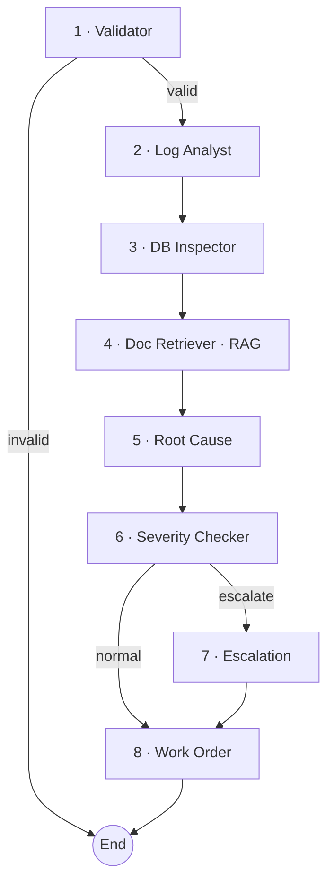

# 🛰️ Backtraces

**Multi-agent DevOps incident investigation pipeline.** Feed it a server name, an
error log, and a timestamp — eight specialized AI agents read the logs, inspect
incident history, retrieve the matching runbook, pin down the root cause, score
severity, escalate if needed, and hand back a step-by-step work order.

Built with **LangGraph** for agent orchestration and **Groq** (Llama 3.3 70B) for
fast inference.

---

## 🧠 How it works

Every incident flows through a dedicated chain of agents. Each agent reads from a
shared `IncidentState` and writes its findings back for the next one.



| # | Agent | Responsibility |
|---|-------|----------------|
| 1 | **Validator** | Checks the inputs are present and well-formed |
| 2 | **Log Analyst** | Extracts error patterns, stack traces and failure type |
| 3 | **DB Inspector** | Correlates past incidents and recent deployments (SQLite) |
| 4 | **Doc Retriever** | Pulls the relevant runbook fix via RAG (Chroma + embeddings) |
| 5 | **Root Cause** | Synthesizes every signal into one clear cause |
| 6 | **Severity Checker** | Scores severity (low → critical) and flags escalation |
| 7 | **Escalation** | Drafts a paging notice when severity is high/critical |
| 8 | **Work Order** | Generates step-by-step remediation instructions |

---

## 🧰 Tech stack

- **LangGraph** — agent graph / state machine
- **LangChain + Groq** — LLM calls (`llama-3.3-70b-versatile`)
- **ChromaDB + sentence-transformers** — runbook retrieval (RAG)
- **SQLite** — incident & deployment history
- **FastAPI + Uvicorn** — HTTP API
- **PyGithub** — commit inspection (optional)

---

## 🚀 Getting started

### 1. Clone & install

```bash
git clone https://github.com/Praveen7123/backtrace.git
cd backtrace
python -m venv .venv
# Windows:  .venv\Scripts\activate
# macOS/Linux:  source .venv/bin/activate
pip install -r requirements.txt
```

### 2. Configure secrets

Create a `.env` file in the project root (it is git-ignored):

```env
GROQ_API_KEY=your_groq_api_key_here
GITHUB_TOKEN=your_github_token_here   # optional, for commit inspection
```

> Get a free Groq API key at https://console.groq.com

### 3. Run it

**CLI** — runs a sample incident end to end (sets up the DB + RAG on first run):

```bash
python main.py
```

**API** — start the HTTP server:

```bash
uvicorn api:app --reload --port 8000
```

Then send an incident:

```bash
curl -X POST http://localhost:8000/investigate \
  -H "Content-Type: application/json" \
  -d '{
    "server_name": "prod-01",
    "incident_time": "2024-03-10 14:23:45",
    "github_repo": "",
    "error_log": "2024-03-10 14:23:45 ERROR OutOfMemoryError: Java heap space"
  }'
```

The response contains the validation result, log/DB/runbook findings, root cause,
severity, escalation, work order, and assigned team.

---

## 📁 Project structure

```
backtrace/
├── api.py              # FastAPI bridge (POST /investigate, GET /health)
├── main.py             # CLI entry point
├── config.py           # Env + paths
├── requirements.txt
├── data/
│   ├── setup_db.py     # Seeds the SQLite incident/deployment DB
│   └── runbooks/       # Source runbooks indexed for RAG
└── src/
    ├── graph/          # LangGraph wiring
    ├── agents/nodes/   # The 8 agents
    ├── rag/            # Chroma setup + retriever
    ├── schemas/        # Shared IncidentState + structured outputs
    └── tools/          # DB, RAG and GitHub tools
```

> `data/incidents.db` and `data/chroma_db/` are generated automatically and are
> not tracked in git.

---

### 👤 Author

**Praveen K S** — [Portfolio](https://praveenportfolio-one.vercel.app/) ·
[LinkedIn](https://www.linkedin.com/in/praveen-ks-661646302/)
